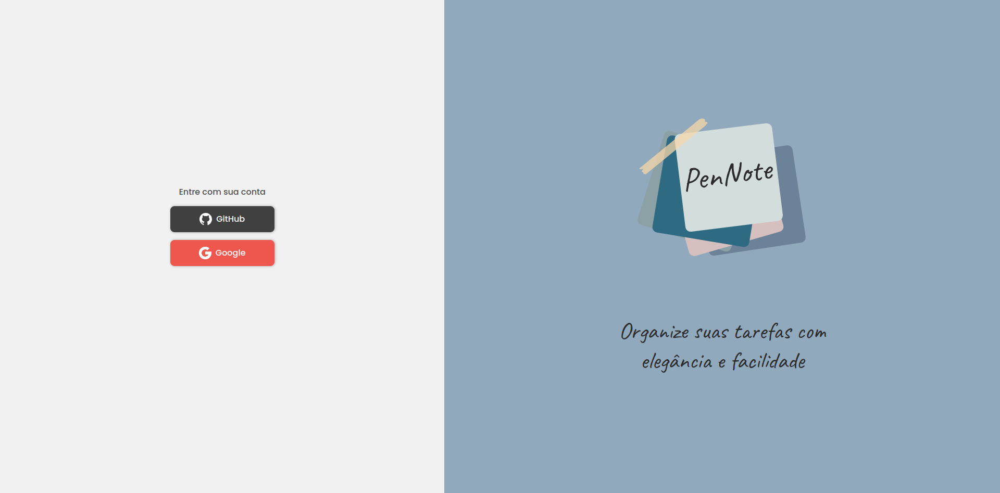
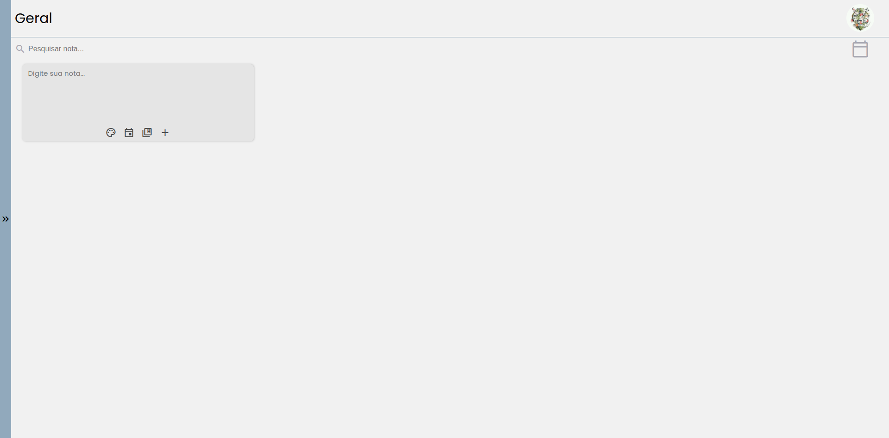

<header>
    <h1>PenNote</h1>
</header>
 
<main>
    

        <h2>📑 Pages</h2>
        

            <h2>Register Page</h2>
            
            <h2>Home Page</h2>
            
        

    

     
    

        <h2>💻 Technologies</h2>
        <ul>
            <li><a href="https://firebase.google.com/">Firebase</a></li>
            <ul>
                <li>Authentication</li>
                <li>Cloud Firestore</li>
                <li>Hosting</li>
            </ul>
            <li><a href="https://reactjs.org/">React.js</a></li>
            <li>React Packages:</li>
            <ul>
                <li><a href="https://react-select.com/home">React Select</a></li>
                <li><a href="https://reactdatepicker.com/">React Datepicker</a></li>
                <li><a href="http://reactcommunity.org/react-modal/">React Modal</a></li>
                <li><a href="https://casesandberg.github.io/react-color/">React Color</a></li>
                <li><a href="https://github.com/duskload/react-device-detect">React Device Detect</a></li>
                <li><a href="https://react-hot-toast.com/">React Hot Toast</a></li>
            </ul>
            <li><a href="https://www.typescriptlang.org/">Typescript</a></li>
            <li><a href="https://sass-lang.com/">Sass</a></li>
        </ul>
    

     
    

        <h2>✏️ Project</h2>
        
PenNote is a web application project made by React.js on the Front-end and Firebase on the Back-end. The app
            allows you to log in with your Google or Github account to create notes and organize your tasks divided by
            color, date and category.

    

     
    

        <h2>🎨 Figma</h2>
        <a href="https://www.figma.com/file/czs9qQAReO0HBxXesCYmoq/PenNote?node-id=0%3A1">Light and Dark mode design</a>
    

     
    

        

        
Created by <a href="https://www.linkedin.com/in/mateusvrs/">Mateus Vieira</a> 💛

    

</main>